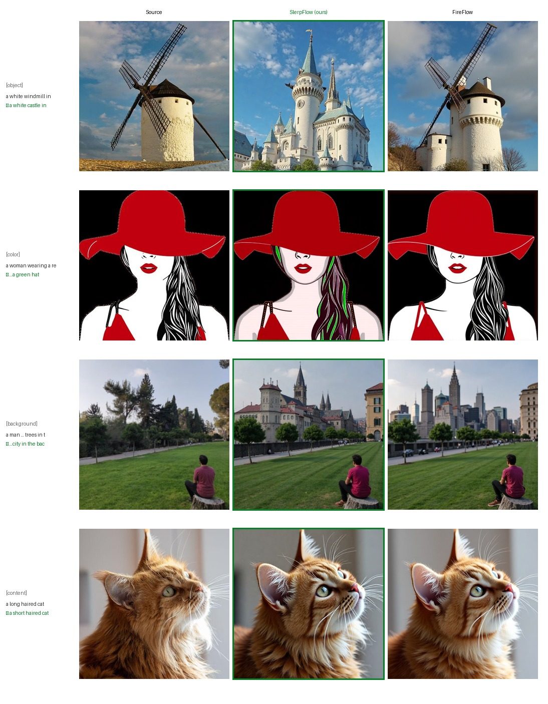

# SlerpFlow: Spherical Trajectory Correction for Rectified Flow Inversion

A drop-in sampler for FLUX-based rectified-flow inversion and image editing. It
extends the **FireFlow** velocity-reuse sampler with **spatial-local spherical
trajectory correction (Slerp)** of the velocity field, producing stronger and
more semantically accurate edits at the same number of function evaluations
(NFE).

The method is implemented as `slerp` in [`flux/sampling.py`](flux/sampling.py).

## Paper

ICML 2026 poster page: https://icml.cc/virtual/2026/poster/65935

## Examples

Source vs. **SlerpFlow (ours)** vs. FireFlow on PIE-Bench edits
(`step=15, cfg=3.0, inject=2, slerp_t=0.5`):



From top to bottom: object replacement (windmill → castle), color
(red hat → green), background (trees → city), and content (long → short hair).

## Setup

Requires Python >= 3.10.

```bash
pip install -r requirements.txt
```

Provide FLUX.1-dev weights via environment variables (otherwise they are
downloaded from HuggingFace `black-forest-labs/FLUX.1-dev`):

```bash
export FLUX_DEV=/path/to/flux1-dev.safetensors
export AE=/path/to/ae.safetensors
```

## Usage

```bash
python run_slerp_edit.py \
    --source_img cat.jpg \
    --source_prompt "a cat sitting on a sofa" \
    --target_prompt "a tiger sitting on a sofa" \
    --output out.jpg \
    --strategy slerp \
    --num_steps 15 --guidance 3.0 --inject 2 --slerp_t 0.5
```

Pass `--strategy fireflow` to reproduce the baseline, and `--offload` if GPU
memory is tight.

## Key arguments

| Arg | Default | Meaning |
|---|---|---|
| `--strategy` | `slerp` | sampler: `slerp` (ours) or `fireflow` (baseline) |
| `--slerp_t` | `0.5` | spherical interpolation factor between `v_curr` and `v_next` |
| `--num_steps` | `15` | ODE steps |
| `--guidance` | `3.0` | CFG scale for the denoise pass (inversion always uses 1.0) |
| `--inject` | `2` | number of feature-injection steps for editing |
| `--offload` | off | move modules to CPU between stages to save VRAM |

## Layout

```
flux/                 FLUX model + samplers (slerp lives in sampling.py)
run_slerp_edit.py     single-image editing entry point
requirements.txt
LICENSE               Apache-2.0 (inherited from FireFlow / RF-Solver-Edit)
model_licenses/       FLUX.1 weight licenses (non-commercial for FLUX.1-dev)
```

## Acknowledgements

SlerpFlow is built directly on top of **FireFlow**. Our `slerp` sampler
replaces FireFlow's velocity-reuse update with a spherical (Slerp) interpolation
of the start/end velocities; the surrounding FLUX model, feature-injection
editing pipeline, and inversion framework are inherited from the FireFlow
codebase. The lineage is:

> **SlerpFlow (ours)** → [FireFlow](https://github.com/HolmesShuan/FireFlow-Fast-Inversion-of-Rectified-Flow-for-Image-Semantic-Editing) → [RF-Solver-Edit](https://github.com/wangjiangshan0725/RF-Solver-Edit) → [FLUX](https://github.com/black-forest-labs/flux)

We thank the authors of FireFlow for releasing their code, on which this work
depends. The code is licensed under Apache-2.0, inherited from FireFlow.
FLUX.1 model weights are governed by their own licenses (see `model_licenses/`);
FLUX.1-dev is for non-commercial use only.

## Citation

If you use this code, please cite SlerpFlow:

```bibtex
@inproceedings{duan2026slerpflow,
  title={SlerpFlow: Spherical Trajectory Correction for Rectified Flow Inversion},
  author={Duan, Wenbin and Shu, Yan and Fu, Zhuoyuan and Zhao, Fangmin and Li, Yan and Zhao, Yaru and Li, Binyang},
  booktitle={Proceedings of the 43rd International Conference on Machine Learning},
  year={2026},
  url={https://icml.cc/virtual/2026/poster/65935}
}
```
